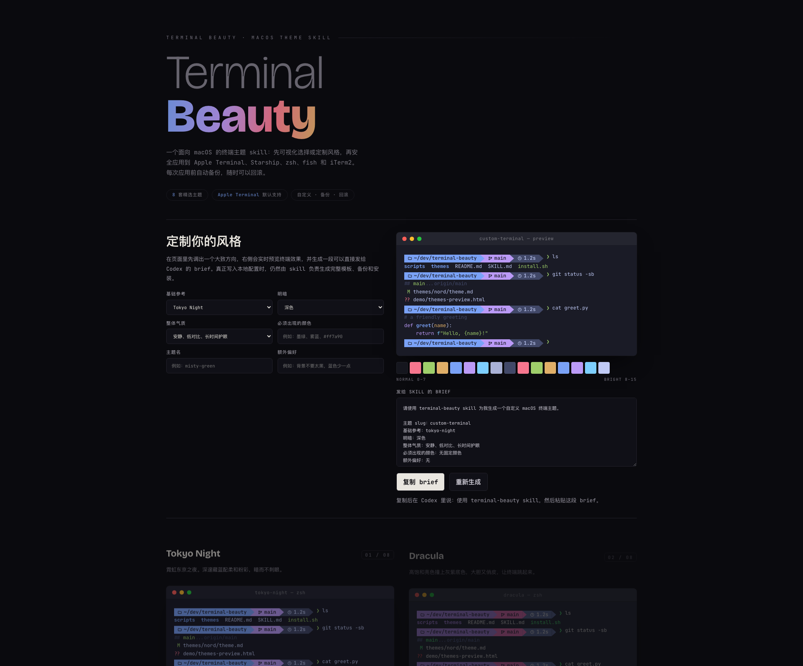

<div align="center">

# Terminal Beauty

> “先看到真实效果，再决定要不要把它装进自己的终端。”

一个面向 macOS 的终端主题 skill，把「看主题 → 选主题 → 备份 → 应用 → 可回滚」做成一条顺滑流程。

它不是一个单纯的配色仓库，而是一个给 Codex / Claude Code 使用的 skill：
先让用户在网页里可视化选择主题，再由本地脚本安全地应用到 zsh、Starship、fish 和 iTerm2。

<p>
  
  
  
  
</p>

[主题预览](https://mayimian123.github.io/terminal-beauty/) ·
[30 秒上手](#30-秒上手) ·
[它做了什么](#它做了什么) ·
[安全与回滚](#安全与回滚) ·
[English](#english)

</div>

---



---

<details>
<summary><strong>使用前请阅读：这个项目会修改哪些本地配置？</strong></summary>

安装主题前会自动创建备份，备份位置在：

```bash
~/.terminal-beauty-backups/
```

之后会根据你的环境修改这些文件：

- `~/.zshrc`
- `~/.config/starship.toml`
- `~/.config/fish/conf.d/terminal-beauty.fish`
- iTerm2 的 `.itermcolors` 主题文件需要手动导入

安装脚本不会删除备份，也不会在没有明确同意的情况下安装新工具。

</details>

---

## 它做了什么

把「在聊天里读主题描述、盲选、反复试错」变成「先看效果图，再安装选中的那一套」。

核心流程是：

```text
打开主题预览页 -> 选择主题名 -> 自动备份 -> 应用主题 -> 不喜欢就回滚
```

它目前支持：

- zsh：写入一行由 Terminal Beauty 管理的主题配置
- Starship：替换 `starship.toml`
- fish：写入 fish 启动配置
- iTerm2：提供可导入的 `.itermcolors` 配色文件

## 为什么不是只放 8 套模板

终端主题是视觉决策。只看主题名和颜色代码，很难判断它放进真实终端后是否舒服。

所以这个仓库分成两层：

- **Gallery**：让用户先看真实终端预览
- **Installer**：只应用用户选中的主题，并且先备份

这样使用 skill 时不需要在对话里展开一长串配色说明，也不需要用户一套套试。

## 30 秒上手

先打开主题预览：

[https://mayimian123.github.io/terminal-beauty/](https://mayimian123.github.io/terminal-beauty/)

选择一个主题名，例如 `tokyo-night`，然后在仓库根目录运行：

```bash
scripts/install.sh tokyo-night
```

打开一个新的终端标签页，或者重新加载 zsh：

```bash
source ~/.zshrc
```

可选主题：

```text
tokyo-night
dracula
nord
catppuccin
gruvbox
rose-pine
everforest
solarized-dark
```

## 安全与回滚

列出已有备份：

```bash
scripts/rollback.sh
```

恢复某个备份：

```bash
scripts/rollback.sh ~/.terminal-beauty-backups/<timestamp>
```

如果你连续试多套主题，`install.sh` 会替换上一条受管理的 zsh 配置，不会在 `.zshrc` 里无限叠加。

## 作为 Skill 使用

当用户说“美化我的 terminal”时，assistant 应该：

1. 检测用户的 macOS 终端环境。
2. 给出主题预览页，而不是在聊天里展开所有配色。
3. 让用户选择一个主题名。
4. 执行 `scripts/install.sh <theme>`。
5. 告诉用户备份路径，以及 iTerm2 的导入路径。

这个 skill 的重点是让用户更快做出视觉选择，同时保留安全回滚路径。

## 项目结构

```text
terminal-beauty/
├── SKILL.md
├── index.html
├── demo/
│   ├── themes-preview.html
│   └── themes-preview.png
├── scripts/
│   ├── detect.sh
│   ├── backup.sh
│   ├── install.sh
│   └── rollback.sh
├── themes/
├── references/
└── tests/
```

几个容易混淆的文件：

- `index.html`：GitHub Pages 入口，让公开链接保持干净。
- `demo/themes-preview.html`：真正的主题预览页面。
- `demo/themes-preview.png`：README 里展示用的静态图。
- `SKILL.md`：给 Codex / Claude Code 读取的工作流说明。

`index.html` 和 `demo/themes-preview.html` 不是重复文件。前者负责稳定入口，后者负责实际 gallery。以后重做预览页，只需要替换 `demo/themes-preview.html`。

## 开发

运行测试：

```bash
bats tests
```

检查 shell 语法：

```bash
bash -n scripts/*.sh
```

## 适用范围

当前版本明确面向 macOS，重点支持 zsh、Starship、fish 和 iTerm2。

Windows Terminal、PowerShell、WSL、Warp、Alacritty、VS Code 集成终端等可以以后再扩展，但不放进第一版，避免把核心体验做复杂。

---

## English

`terminal-beauty` is a macOS-first terminal theme skill and installer for zsh,
Starship, fish, and iTerm2.

It is designed around a visual-first flow:

```text
preview themes -> choose a theme name -> back up current config -> apply theme -> roll back if needed
```

Open the gallery:

[https://mayimian123.github.io/terminal-beauty/](https://mayimian123.github.io/terminal-beauty/)

Install a theme:

```bash
scripts/install.sh tokyo-night
```

The installer creates a backup under:

```bash
~/.terminal-beauty-backups/
```

Then it applies the selected theme where supported:

- zsh: appends one managed source line to `~/.zshrc`
- Starship: writes `~/.config/starship.toml`
- fish: writes `~/.config/fish/conf.d/terminal-beauty.fish` when fish is installed
- iTerm2: copies the `.itermcolors` preset and prints import instructions

Rollback:

```bash
scripts/rollback.sh
scripts/rollback.sh ~/.terminal-beauty-backups/<timestamp>
```

This project intentionally targets macOS first. Other terminal environments can
be supported later, but they are outside the first version.
